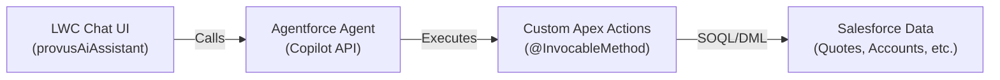

# Provus CPQ — Agentforce AI Assistant Implementation Guide

> [!IMPORTANT]
> This guide assumes you have a **Salesforce org with Agentforce/Einstein Copilot** enabled.
> You need: **Einstein Generative AI** add-on license + **Agentforce** enabled in Setup.

---

## Overview — What We're Building

A conversational AI assistant embedded in the `provusExpressApp` that lets users type natural language commands like:
- *"Create a new quote for Acme Corp"*
- *"Clone quote Q-0012"*
- *"Add a Fullstack Developer to quote Q-0015"*
- *"Adjust staffing to 3 months"*

The architecture has **3 layers**:



---

## Stage 1 — Apex: Create Invocable Actions

> [!NOTE]
> This is the **code stage**. You write all Apex first before touching Setup.

Create a new file: `force-app/main/default/classes/AgentforceQuoteActions.cls`

### Action 1: Create a Quote

```apex
public class AgentforceQuoteActions {

    // ── 1. CREATE QUOTE ───────────────────────────────────────────────────
    public class CreateQuoteRequest {
        @InvocableVariable(label='Account Name' required=true)
        public String accountName;

        @InvocableVariable(label='Quote Name' required=false)
        public String quoteName;
    }

    public class CreateQuoteResult {
        @InvocableVariable
        public String resultMessage;

        @InvocableVariable
        public String quoteId;
    }

    @InvocableMethod(
        label='Create CPQ Quote'
        description='Creates a new CPQ quote for the specified account name.'
        category='Provus CPQ'
    )
    public static List<CreateQuoteResult> createQuote(List<CreateQuoteRequest> requests) {
        List<CreateQuoteResult> results = new List<CreateQuoteResult>();
        for (CreateQuoteRequest req : requests) {
            CreateQuoteResult res = new CreateQuoteResult();
            try {
                List<Account> accounts = [SELECT Id FROM Account WHERE Name LIKE :('%' + req.accountName + '%') LIMIT 1];
                if (accounts.isEmpty()) {
                    res.resultMessage = 'Account "' + req.accountName + '" not found. Please check the account name.';
                } else {
                    Quote__c q = new Quote__c();
                    q.Account__c = accounts[0].Id;
                    q.Name__c = String.isNotBlank(req.quoteName) ? req.quoteName : 'Quote - ' + req.accountName;
                    q.Status__c = 'Draft';
                    insert q;
                    res.quoteId = q.Id;
                    res.resultMessage = 'Quote "' + q.Name__c + '" created successfully for ' + req.accountName + '!';
                }
            } catch (Exception e) {
                res.resultMessage = 'Error: ' + e.getMessage();
            }
            results.add(res);
        }
        return results;
    }
}
```

### Action 2: Clone a Quote

```apex
    public class CloneQuoteRequest {
        @InvocableVariable(label='Quote Name or Number' required=true)
        public String quoteName;
    }

    @InvocableMethod(
        label='Clone CPQ Quote'
        description='Clones an existing CPQ quote by its name or number.'
        category='Provus CPQ'
    )
    public static List<CreateQuoteResult> cloneQuote(List<CloneQuoteRequest> requests) {
        // ... reuse your existing QuoteController.cloneQuote() logic
    }
```

### Action 3: Search Quotes

```apex
    public class SearchRequest {
        @InvocableVariable(label='Search Term' required=false)
        public String searchTerm;

        @InvocableVariable(label='Status Filter' required=false)
        public String status;
    }

    @InvocableMethod(
        label='Search CPQ Quotes'
        description='Searches for quotes by name, account, or status. Returns a summary list.'
        category='Provus CPQ'
    )
    public static List<CreateQuoteResult> searchQuotes(List<SearchRequest> requests) {
        // Returns formatted summary string back to the agent
    }
```

> [!TIP]
> Create **one `@InvocableMethod` per operation**. Each becomes a separate Action in Agentforce.
> Good candidates: Create Quote, Clone Quote, Search Quotes, Summarize Quote, Add Line Item, Adjust Duration.

---

## Stage 2 — Deploy to Org

Deploy your Apex classes before configuring anything in Setup:

```bash
sf project deploy start --source-dir force-app/main/default/classes/AgentforceQuoteActions.cls
```

---

## Stage 3 — Salesforce Setup: Register Custom Actions

> Navigate to: **Setup → Agentforce Agents → Actions**

For **each** `@InvocableMethod` you created:

| Field | Value |
|---|---|
| **Action Type** | Apex |
| **Label** | e.g. `Create CPQ Quote` |
| **API Name** | e.g. `Create_CPQ_Quote` |
| **Description** | *Tell the AI when to use it* (see below) |
| **Apex Class** | `AgentforceQuoteActions` |
| **Apex Method** | Select the correct method |

**Critical: The Description field is your AI prompt.** Write it like a directive:

> ✅ Good: *"Use this action when the user wants to create, generate, or start a new quote for a customer or account. Extract the account name from the user's message."*

> ❌ Bad: *"Creates a quote"*

---

## Stage 4 — Create an Agent (Copilot)

> Navigate to: **Setup → Agentforce Agents → New Agent**

### Basic Configuration

| Field | Value |
|---|---|
| **Agent Name** | `Provus CPQ Assistant` |
| **Description** | A CPQ assistant that helps users create quotes, manage accounts, and configure service line items. |
| **Role** | Select "Sales" or create custom |

### Add Topics (this is how the AI categorizes user intents)

> Under the Agent → **Topics** tab → New Topic

#### Topic 1: Quote Management

| Field | Value |
|---|---|
| **Topic Label** | `Quote Management` |
| **Description** | *Handles all requests related to creating, cloning, searching, and managing CPQ quotes.* |
| **Scope** | *The user wants to work with quotes — create new ones, find existing ones, clone a quote, or check quote status.* |
| **Instructions** | *Always confirm the account name before creating a quote. If no account is specified, ask the user for it.* |
| **Actions to enable** | ✅ Create CPQ Quote, ✅ Clone CPQ Quote, ✅ Search CPQ Quotes |

#### Topic 2: Line Item & Staffing

| Field | Value |
|---|---|
| **Topic Label** | `Staffing & Line Items` |
| **Description** | *Handles requests to add resources, adjust duration, modify resource roles on a quote.* |
| **Scope** | *The user wants to add engineers, adjust staffing levels, duration, or assign roles to a quote.* |
| **Actions to enable** | ✅ Add Line Item, ✅ Adjust Duration |

#### Topic 3: General Help

| Field | Value |
|---|---|
| **Topic Label** | `General Assistance` |
| **Description** | *Answers general questions about how to use the Provus CPQ application.* |
| **Scope** | *Use this for onboarding questions, how-to guidance, or feature explanations.* |
| **Actions** | Standard: `Answer Questions from Knowledge` |

---

## Stage 5 — Configure System Prompt (Agent Identity)

> Under the Agent → **Configuration** tab → System Prompt

```
You are the Provus CPQ Assistant, an intelligent quoting helper embedded in the Provus Express Quoting application.

Your capabilities:
- Create new service quotes for accounts
- Clone existing quotes
- Search and summarize quotes
- Help add resource roles and line items to quotes
- Guide users through the quoting process

Personality: Professional, concise, helpful. Respond in 1-3 sentences unless the user asks for detail.

Always:
- Confirm the account name before creating a quote
- Confirm before making any destructive changes
- Say what you did after completing an action

Never:
- Invent account names or quote numbers
- Perform actions without the user's intent being clear
```

---

## Stage 6 — Activate & Test in Builder

1. Click **Activate** in the Agent builder.
2. Use the built-in **Conversation Preview** panel on the right to test:
   - Type: *"Create a quote for Acme"* → Should ask for confirmation or create it
   - Type: *"Search for all draft quotes"* → Should call SearchQuotes action
   - Type: *"What can you help me with?"* → Should answer from system prompt

---

## Stage 7 — LWC Integration (Embed in Your App)

This is where the UI from the screenshot gets wired to the real agent.

### Option A: Use Salesforce's Built-in Copilot Panel (Easiest)

Add the standard `einstein-copilot` component to `provusExpressApp.html`:

```html
<!-- In provusExpressApp.html, when activePage === 'ai' -->
<template if:true={showAi}>
    <einstein-copilot></einstein-copilot>
</template>
```

This renders the full Agentforce UI automatically. No additional code needed.

### Option B: Build Custom UI (what's in your screenshot)

If you want your custom `provusAiAssistant` LWC with the branded header, suggestions chips, etc., you call the **Agentforce Conversation API** from Apex:

```apex
// AgentforceChatController.cls
public class AgentforceChatController {

    @AuraEnabled
    public static String sendMessage(String sessionId, String userMessage) {
        // Use ConnectApi.AgentConversation to send messages
        ConnectApi.AgentConversationInput input = new ConnectApi.AgentConversationInput();
        input.message = userMessage;

        ConnectApi.AgentConversationOutput output =
            ConnectApi.AgentConversation.sendMessage('YOUR_AGENT_API_NAME', sessionId, input);

        return output.message;
    }

    @AuraEnabled
    public static String createSession() {
        ConnectApi.AgentConversationSessionOutput session =
            ConnectApi.AgentConversation.createSession('YOUR_AGENT_API_NAME');
        return session.sessionId;
    }
}
```

Then your `provusAiAssistant.js` calls these methods on mount and on send.

---

## Stage 8 — Security: Named Credentials & Permissions

> [!CAUTION]
> Before going live, ensure your Permission Sets are configured correctly.

1. **Go to**: Setup → Permission Sets → `CPQ_Manager_Access` and `CPQ_Salesperson_Access`
2. **Add**: `Agentforce Conversation` — read and use
3. **Add**: Access to the new `AgentforceQuoteActions` Apex class

---

## Full Stage Summary

| # | Stage | Where | What |
|---|---|---|---|
| 1 | Write Apex | VS Code | Create `AgentforceQuoteActions.cls` with `@InvocableMethod` |
| 2 | Deploy | Terminal | `sf project deploy start` |
| 3 | Register Actions | Setup → Agentforce → Actions | Point to each Apex method + write AI descriptions |
| 4 | Create Agent | Setup → Agentforce → Agents | Create agent, configure identity |
| 5 | Create Topics | Agent Builder → Topics | Define intents + wire actions to topics |
| 6 | Write System Prompt | Agent → Configuration | Define AI personality and rules |
| 7 | Test in Builder | Agent → Conversation Preview | Validate all actions respond correctly |
| 8 | Embed in LWC | VS Code | Wire `einstein-copilot` or custom UI to `AgentforceChatController` |
| 9 | Permissions | Setup → Permission Sets | Grant Agentforce access to user groups |
| 10 | Go Live | Agent Builder | Activate agent |

---

> [!NOTE]
> The **AI suggestion chips** (`Create a new quote`, `Clone a quote`, etc.) in your screenshot are just hardcoded buttons in the LWC that pre-fill the chat input — they do not require any Agentforce configuration.
